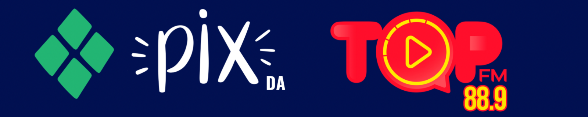

# Rádio Top FM 88.9 - Aplicativo Oficial



Bem-vindo ao repositório oficial do aplicativo móvel da **Rádio Top FM 88.9**, a emissora que agita Imperatriz, Maranhão. Este projeto foi desenvolvido com a missão de conectar nossos ouvintes à nossa programação de forma moderna, interativa e acessível.

O aplicativo foi construído com **Flutter**, garantindo uma experiência de usuário fluida e nativa tanto em dispositivos iOS quanto Android a partir de um único código-base.

---

## 🎯 Nossa Missão

> Levar informação com responsabilidade e imparcialidade, além de promover alegria e prêmios aos nossos ouvintes e internautas. A Rádio Top acompanha as inovações digitais e está cada vez mais preparada para oferecer o melhor nas ondas do rádio e nas plataformas online.

---

## 🚀 Recursos Principais

*   **Rádio Ao Vivo 24/7:** Ouça nossa programação completa com um stream de áudio digital de alta qualidade.
*   **Streaming de Vídeo:** Assista às transmissões ao vivo diretamente do nosso estúdio e sinta-se parte da ação.
*   **Player Persistente:** O áudio continua tocando em segundo plano, permitindo que você navegue em outros aplicativos sem interrupções.
*   **Interatividade Total:** Participe da programação! Envie sua mensagem, peça sua música e fale conosco diretamente pelo WhatsApp com apenas um toque.
*   **Conexão Social:** Acesse rapidamente nossos perfis no TikTok, Facebook e YouTube para não perder nenhuma novidade.
*   **Design Moderno e Intuitivo:** Desfrute de uma interface imersiva, com um player animado e uma navegação clara e acessível.
*   **Transparência:** Acesse facilmente as seções "Sobre a Rádio", "Termos de Uso" e "Política de Privacidade" diretamente no menu do aplicativo.

---

## 🛠️ Tecnologias e Pacotes

*   **Framework:** Flutter 3.x
*   **Linguagem:** Dart
*   **Gerenciamento de Estado:** `provider`
*   **Áudio Streaming:** `just_audio`
*   **Vídeo Streaming:** `video_player` & `chewie`
*   **Interação com o Sistema:** `url_launcher`
*   **Componentes de UI:**
    *   `google_fonts` para uma tipografia rica e legível.
    *   `font_awesome_flutter` para ícones modernos.
    *   `carousel_slider` para banners de destaque.
    *   `marquee` para exibir o nome da música em movimento.

---

## ♿ Acessibilidade (A11Y)

Nosso compromisso é criar uma experiência que possa ser desfrutada por todos. O aplicativo foi desenvolvido seguindo as diretrizes de acessibilidade, incluindo:
*   Contraste de cores adequado para legibilidade.
*   Áreas de toque suficientemente grandes.
*   Suporte para leitores de tela (ainda em aprimoramento).

---

## ⚙️ Configuração e Instalação

**Pré-requisitos:**
*   Ter o [Flutter SDK](https://flutter.dev/docs/get-started/install) instalado.
*   Um editor de código como VS Code ou Android Studio.

**1. Clone o repositório:**
```bash
git clone https://github.com/seu-usuario/radio-top-app.git
cd radio-top-app
```

**2. Adicione os arquivos de configuração do Firebase (se aplicável):**
Para futuras integrações com serviços Firebase (como Push Notifications ou Analytics), você precisará adicionar seus próprios arquivos de configuração:
*   **iOS:** Coloque seu `GoogleService-Info.plist` na pasta `ios/Runner/`.
*   **Android:** Coloque seu `google-services.json` na pasta `android/app/`.

**3. Instale as dependências:**
```bash
flutter pub get
```

**4. Gere os ícones do aplicativo (opcional):**
Se você alterar a imagem do ícone em `assets/images/logo.png`, execute o comando abaixo para atualizar os ícones em todas as plataformas:
```bash
flutter pub run flutter_launcher_icons
```

**5. Execute o aplicativo:**
```bash
flutter run
```

---

